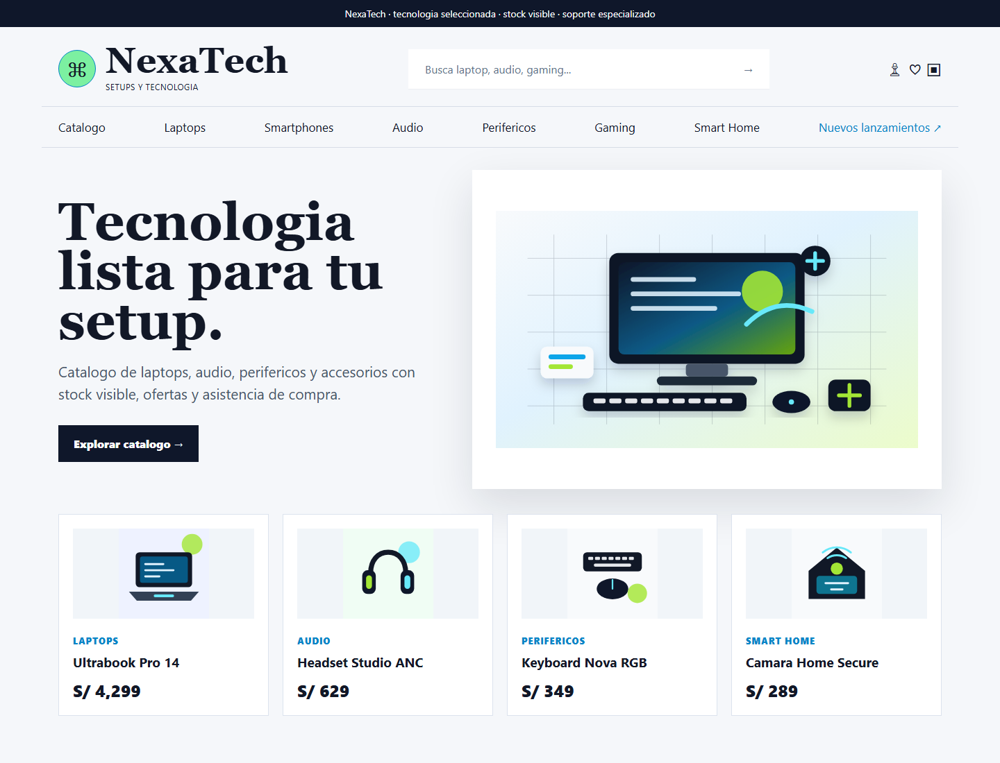

# NexaTech



Sistema web para una tienda de tecnologia, construido con React, TypeScript, Vite, Express y PostgreSQL. Incluye catalogo, busqueda, detalle de producto, carrito, checkout, cuenta de usuario y un asistente de compras con respuestas locales.

## Vista general

- Interfaz responsive orientada a productos tecnologicos.
- Catalogo con imagenes reales desde Unsplash.
- API local con Express y capa de acceso a datos preparada para PostgreSQL.
- Datos demo para ejecutar el proyecto sin depender de servicios externos.
- Pruebas automatizadas, lint, typecheck y build configurados.

## Requisitos

- Node.js 20 o superior.
- npm.
- PostgreSQL opcional para trabajar con base de datos real.

## Instalacion

```powershell
npm ci
```

## Ejecucion local

```powershell
npm run dev
```

Luego abre la URL local que muestre la terminal, normalmente `http://127.0.0.1:3000`.

## Validacion

```powershell
npm run typecheck
npm run lint
npm test
npm run build
```

## Variables de entorno

El archivo real `.env.local` no se sube al repositorio. Usa `variables-entorno.ejemplo` como guia para crear tu configuracion local.

## Despliegue en Vercel

El repositorio incluye `vercel.json`, `api/index.ts` y `api/[...path].ts` para publicar el frontend Vite junto con la API Express como Vercel Function. El build configurado en Vercel es `npm run build` y la salida es `dist`.

Para una primera demo publica puedes desplegar sin base de datos: la API responde con datos demo y evita que el frontend reciba HTML en rutas `/api`. Para una version persistente, crea una base PostgreSQL externa, por ejemplo Neon, y agrega estas variables en Vercel:

```txt
CASAVIVA_DATABASE_URL=postgresql://...
CASAVIVA_ORIGIN=https://tu-dominio.vercel.app
CASAVIVA_ALLOWED_ORIGINS=
CASAVIVA_DEMO=true
CASAVIVA_MAIL=disabled
CASAVIVA_INDEXABLE=false
CASAVIVA_CONTENT_FILE=configuracion/contenido-tienda.json
```

Usa `CASAVIVA_DEMO=true` para una demo sintetica. Con `CASAVIVA_DEMO=false`, primero ejecuta las migraciones contra tu PostgreSQL y luego importa un catalogo aprobado.

## Estructura

| Ruta | Contenido |
|---|---|
| `codigo` | Frontend React, vistas, modelos, datos y servicios |
| `servidor` | API local, seguridad, correo, pagos y conexion a datos |
| `servidor/migraciones` | Scripts SQL de estructura |
| `base-de-datos` | Consultas de apoyo para revisar y modificar datos |
| `pruebas` | Pruebas automatizadas |
| `publico/recursos` | Recursos estaticos del proyecto |

## Nota

Algunos nombres tecnicos internos se mantienen por compatibilidad con la base original, pero la experiencia visible del sistema esta orientada a NexaTech.

## Enfoque de portafolio

Proyecto pensado para demostrar una aplicacion full-stack con frontend moderno, API Express, base PostgreSQL opcional, pruebas automatizadas y despliegue preparado para Vercel.
